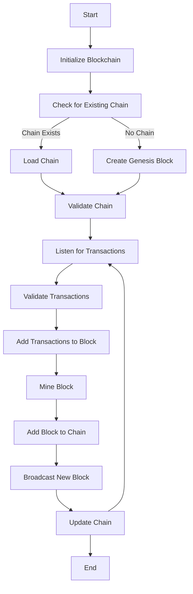

# softEng

```mermaid
flowchart TD
    A[Start] --> B[Initialize Blockchain]
    B --> C[Check for Existing Chain]
    C --> |Chain Exists| D[Load Chain]
    C --> |No Chain| E[Create Genesis Block]
    D --> F[Validate Chain]
    E --> F
    F --> G[Listen for Transactions]
    G --> H[Validate Transactions]
    H --> I[Add Transactions to Block]
    I --> J[Mine Block]
    J --> K[Add Block to Chain]
    K --> L[Broadcast New Block]
    L --> M[Update Chain]
    M --> G
    M --> N[End]
```