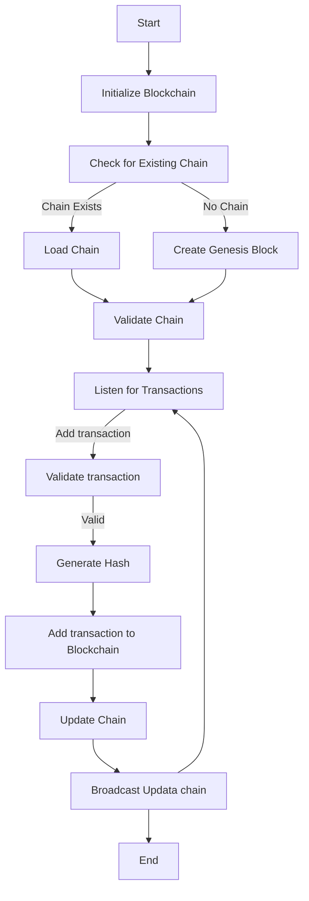
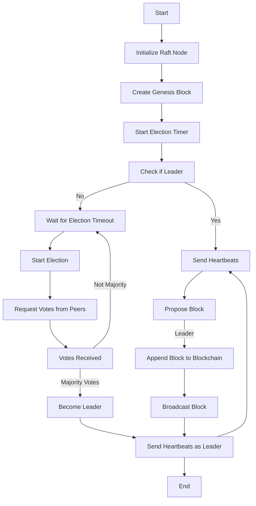

# softEng

current directory

blockchain/
├── chaincode/
│   ├── src/
│   │   ├── chaincode.go         # Main chaincode logic
│   │   ├── model/
│   │   │   ├── block.go         # Model files as dependencies
│   │   │   ├── admin.go
│   │   │   ├── credential.go
│   │   │   ├── student.go
│   │   │   ├── admin.go         # Optional, for admin-specific features
├── go.mod               # Module dependencies specific to chaincode
├── go.sum               # Dependency checksum file
